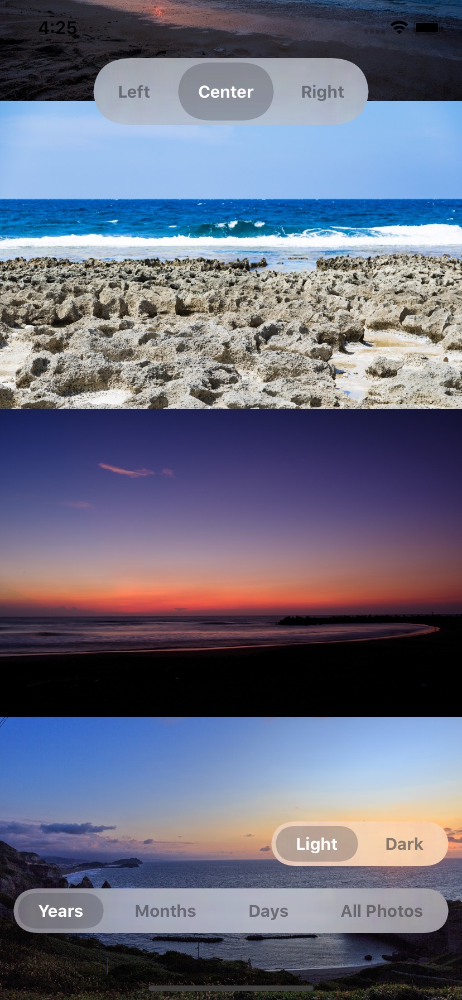
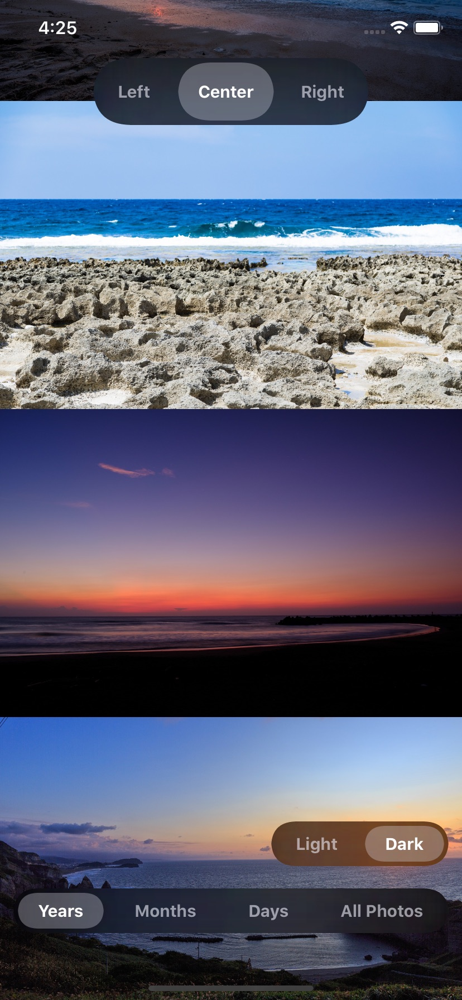

# FloatingSwitch

A replication of a segmented control in the iOS 13 Photos.app.

 

<video controls muted loop autoplay width=375 src="https://user-images.githubusercontent.com/1835776/109355311-60ec0080-78c2-11eb-8782-b09147ff4473.mp4" alt="Demo play"></video>

# Core Classes

- `FloatingSwitch.swift`
- `FloatingSwitch.xib`
- `FloatingSwitchSegment.swift`
- `FloatingSwitchSegment.xib`

# Usage

1. Install a custom view on Interface Builder.
2. Assign the custom view class as `FloatingSwitch`.
3. Set an appropriate layouts. In the default implementation of FloatingSwitch, the width follows the intrinsic size.
4. Set segments with `setSegments(with:)` method.
5. Set `target` and `action`. Then you can catch control events when users switch segments.

See `SampleViewController.swift` for usage.

# License

See [LICENSE](./LICENSE) for details.
